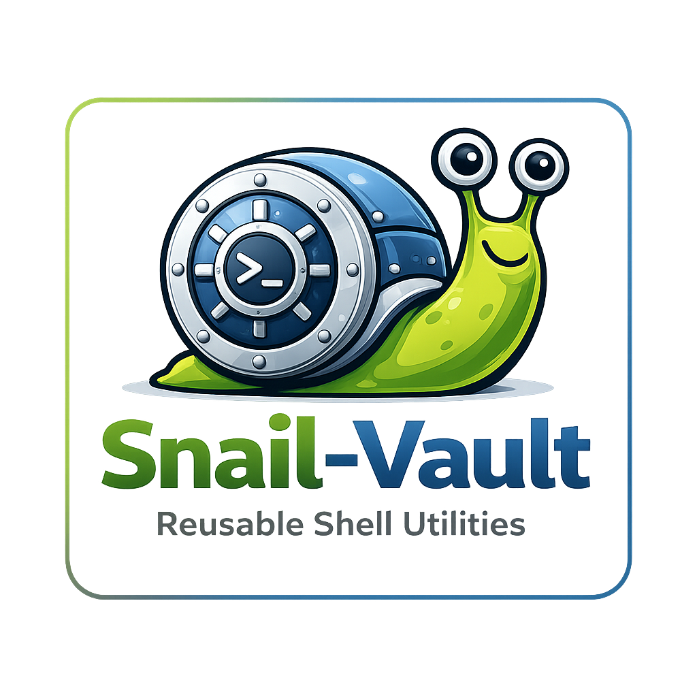

<!-- INFO {{{

# [/Snail-Vault/README.md]
# author        : Pascal Malouin (https://github.com/fantomH)
# created       : 2026-03-13 12:58:04 UTC
# updated       : 2026-03-13 12:58:04 UTC
# description   : Snail-Vault README.

}}} -->

<div align="center">



# Snail-Vault

Reusable Shell Utilities

</div>

<br>

## List files

List regular files from given paths.

Usage: list_files --out VAR \[OPTIONS] \[--] [PATH...]

```
#!/usr/bin/env sh

source ../Snail-Vault/list-files.sh

files=()

list_files --out files -- /etc /var/log file.txt

printf '%s\n' "${files[@]}"
```

<!--
# vim: foldmethod=marker
-->
